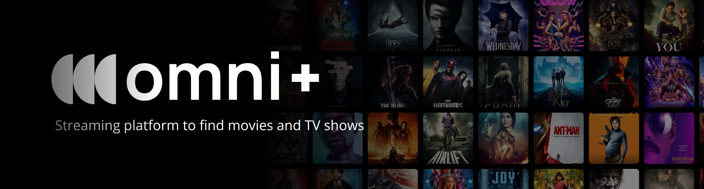
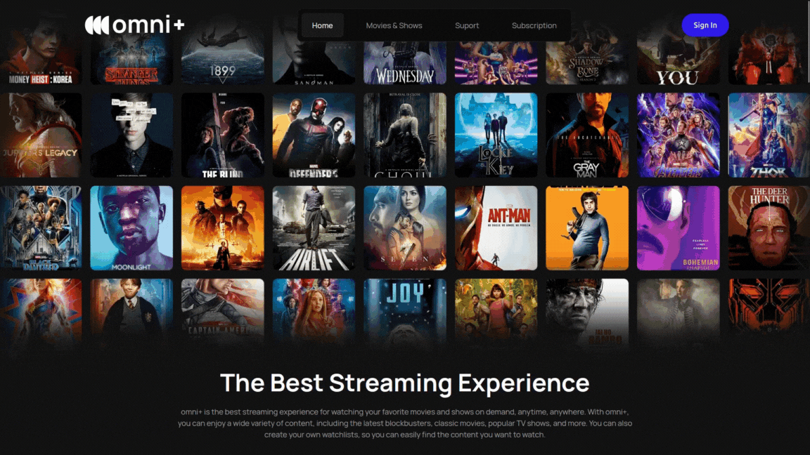

# omni-streaming



<p align="center">
  <a href="https://choosealicense.com/licenses/mit/">
    
  </a>
  <a href="https://nextjs.org">
    
  </a>
  <a href="https://developer.mozilla.org/en-US/docs/Web/JavaScript">
    
  </a>
  <a href="https://swiperjs.com">
    
  </a>
</p>

---

## Table of Contents

- [About the Project](#-about-the-project)
- [Release](#-release)
- [Features](#-features)
- [Technologies Used](#-technologies-used)
- [Demo](#-demo)
- [How to Run Locally](#️-how-to-run-locally)
- [Environment Variables](#-environment-variables)
- [Upcoming Features](#-upcoming-features)
- [References](#-references)
- [Contributing](#-contributing)
- [Author](#-author)
- [License](#-license)

---

## About the Project

**omni+** is a fictional streaming platform for movies and TV shows, developed as a personal project focused on responsive design and user experience. The application consumes data from the [TMDB API](https://www.themoviedb.org/) to list, browse, and detail audiovisual content in real time.

---

## Version 0.1.0 Release

Initial version with basic features for displaying movies and TV shows, using dynamic rendering and automated routes with **Next.js**.

---

## Features

- Listing of movies and TV shows via TMDB API
- Interactive carousels with SwiperJS
- Lazy loading with `Suspense` (Next.js)
- Responsive layout (mobile, tablet, and desktop)
- Navigation with dynamic routes (movies, seasons, and episodes)

---

## Technologies Used

- [Next.js](https://nextjs.org/)
- [JavaScript (ES6+)](https://developer.mozilla.org/en-US/docs/Web/JavaScript)
- [CSS Modules](https://github.com/css-modules/css-modules)
- [SwiperJS](https://swiperjs.com/)

---

## Demo

Preview of the platform in action:



---

## How to Run Locally

1. **Clone the repository:**

```bash
git clone https://github.com/kauansl2006/omni-streaming
```

2. **Navigate to the project folder:**

```bash
cd omni-streaming
```

3. **Install dependencies:**

```bash
npm install
```

4. **Start the development server:**

```bash
npm run dev
```

---

## Environment Variables

Create a `.env` file in the root of the project and add the following variables:

```env
TMDB_BASE_URL=https://api.themoviedb.org/3
TMDB_TOKEN=your_api_token
```

---

## Upcoming Features

- User authentication and registration
- User profile page
- Search for movies and TV shows
- Add content to favorites (watchlist)

---

## References

- Design inspired by: [Figma - OTT Dark Theme UI](https://www.figma.com/community/file/1294589591426976269/ott-dark-theme-website-ui-design-template-for-media-streaming-movies-and-tv-free-editable)

- Official documentation: [Next.js](https://nextjs.org) • [SwiperJS](https://swiperjs.com) • [TMDB API](https://developer.themoviedb.org/)

---

## Contributing

Contributions are always welcome!

1. Fork this repository  
2. Create a branch (`git checkout -b feature/your-feature-name`)  
3. Commit your changes (`git commit -m 'feat: my new feature'`)  
4. Push to your branch (`git push origin feature/your-feature-name`)  
5. Open a **Pull Request**

---

## 👤 Author

<table border="collapse">
  <tr>
    <td align="center">
      
      <br>
      <strong>Kauan Lima</strong>  
      <br>
      <a href="https://github.com/kauansl2006">kauansl2006</a>
    </td>
  </tr>
</table>

---

## 📄 License

This project is licensed under the terms of the [MIT License](https://choosealicense.com/licenses/mit/).